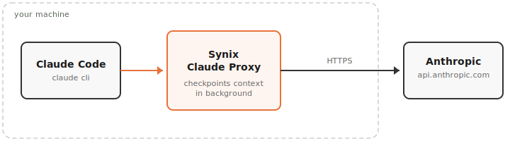
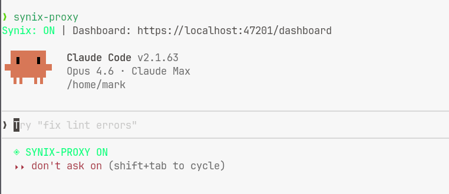
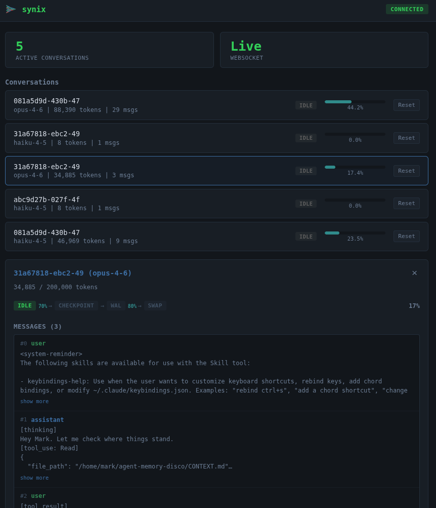

<p align="center">
  
</p>

<p align="center">
  Pre-computes conversation summaries so Claude Code compaction is instant instead of a 30-second stall.
</p>

## Install

```sh
curl -fsSL https://raw.githubusercontent.com/marklubin/double-buffer-proxy/main/install.sh | sh
```

```sh
# Add to ~/.zshrc or ~/.bashrc
alias claude="claude-db-proxy"
```

That's it. Run `claude` as normal.

## What It Does

<p align="center">
  
</p>

A local proxy that sits between Claude Code and the Anthropic API on your machine. It pre-computes a conversation checkpoint at 70% context utilization. When Claude auto-compacts at 80%, the proxy returns the checkpoint instantly — no API call, no wait.

**Runs entirely on your machine.** No third-party servers, no data leaves your network. The proxy runs in a local Docker/Podman container and only communicates with `api.anthropic.com` — the same endpoint Claude Code already talks to. Your API keys and conversation data never touch anything else.



## Dashboard

Real-time monitoring of all active conversations at `https://localhost:8443/dashboard`.



## Commands

```sh
claude                     # start proxy + launch Claude Code
claude proxy-help          # proxy-specific help
claude proxy-update        # update proxy image + wrapper
claude-db-proxy status     # check if proxy is running
claude-db-proxy stop       # stop the proxy container
claude-db-proxy logs       # tail structured JSON logs
claude-db-proxy dashboard  # print dashboard URL
```

## Configuration

| Variable | Default | Description |
|----------|---------|-------------|
| `DBPROXY_CHECKPOINT_THRESHOLD` | `0.70` | Pre-compute checkpoint at this % of context window |
| `DBPROXY_SWAP_THRESHOLD` | `0.80` | Mark checkpoint ready to serve at this % |
| `DBPROXY_LOG_LEVEL` | `INFO` | `DEBUG`, `INFO`, `WARNING`, `ERROR` |
| `DBPROXY_PASSTHROUGH` | `false` | Disable buffer logic (pure proxy mode) |
| `DBPROXY_PROXY_PORT` | `8080` | CONNECT redirector port |
| `DBPROXY_DASHBOARD_PORT` | `8443` | Dashboard/proxy port |

```sh
DBPROXY_CHECKPOINT_THRESHOLD=0.60 claude-db-proxy
```

## How It Works

The proxy uses Claude Code's native `HTTPS_PROXY` support, scoped to the `claude` process only. A CONNECT redirector intercepts `api.anthropic.com` traffic and routes it to the proxy; everything else (OAuth, MCP servers, telemetry) passes through untouched. No `/etc/hosts`, no system DNS changes, no root required.

### Buffer Lifecycle

```
0%────────────70%────────────80%────────100%
│              │              │           │
│    Normal    │  Proxy       │  Claude   │
│   operation  │  checkpoints │  compacts │
│              │  (background)│  (instant)│
```

| Phase | What happens |
|-------|-------------|
| **IDLE** | Normal operation. Proxy tracks token usage. |
| **CHECKPOINTING** | Background API call to pre-compute a conversation summary. |
| **WAL_ACTIVE** | Checkpoint ready. New messages recorded in write-ahead log. |
| **SWAP_READY** | Pre-computed checkpoint ready to serve on next compact request. |

The proxy never initiates compaction — Claude Code drives the process. When Claude sends a compact request, the proxy returns the pre-computed checkpoint if available, or forwards to the API if not. The proxy never blocks or degrades the experience.

## Development

```sh
git clone https://github.com/marklubin/double-buffer-proxy
cd double-buffer-proxy
uv sync --dev

uv run pytest tests/ -x -v          # 151 tests
uv run -m dbproxy --log-level DEBUG  # run proxy locally
docker compose build && docker compose up -d  # container
```

## Uninstall

```sh
claude-db-proxy uninstall
```
